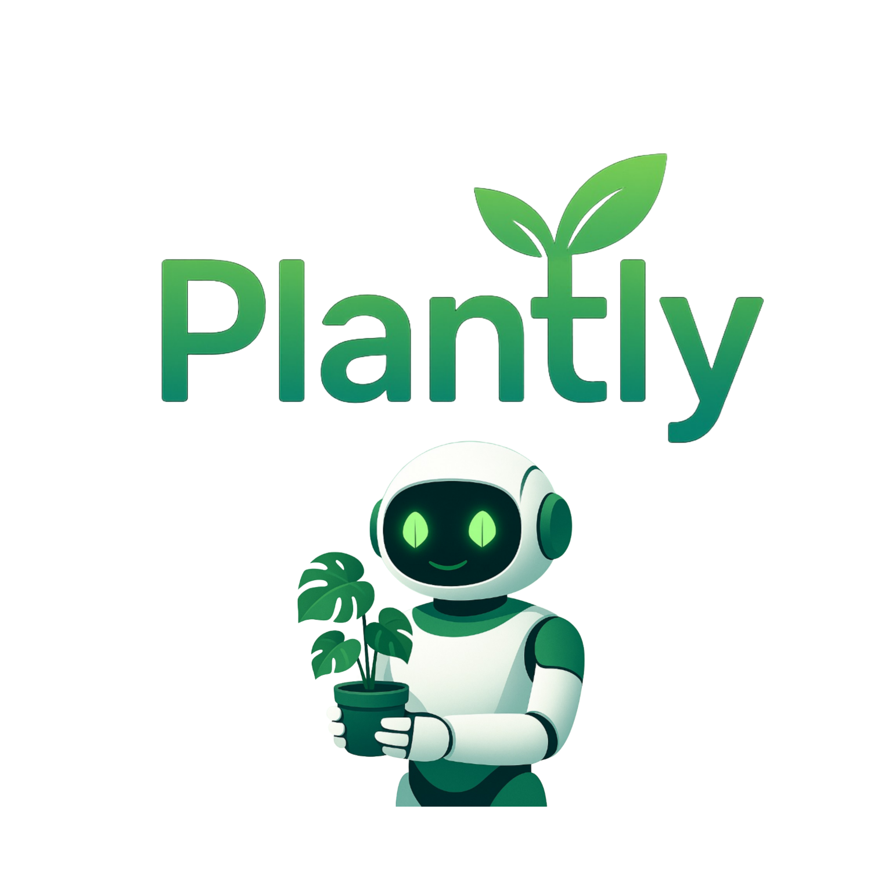

# 🌱 Plantly - AI-Powered Plant Care App

<div align="center">
  
  
  **Bitki bakımı ve hastalık tespiti için yapay zeka destekli mobil uygulama**
  
  
  
  
  
  
  [](https://drive.google.com/file/d/1_avucqfeILIrGrNzb-rhqZLyDqlhQe8S/view?usp=sharing)
  
  **🔗 Related Repositories:**
  - 🤖 [AI Server Backend](https://github.com/bnrks/plantly-server) - AI hastalık tespiti ve chat servisleri
</div>

## 📱 Uygulama Hakkında

Plantly, bitki severler için geliştirilmiş kapsamlı bir bitki bakım uygulamasıdır. Yapay zeka teknolojisini kullanarak bitkilerinizin sağlığını analiz eder, hastalık tespiti yapar ve kişiselleştirilmiş bakım önerileri sunar.

### ✨ Temel Özellikler

- 🤖 **AI Destekli Hastalık Tespiti**: Yaprak fotoğrafları analiz ederek hastalık tespiti
- 💬 **Akıllı Chat Asistanı**: Bitki bakımı hakkında sorularınızı yanıtlayan AI asistan
- 📸 **Görsel Analiz**: Gerçek zamanlı bitki durumu analizi
- 🌿 **Bitki Koleksiyonu**: Kişisel bitki koleksiyonunuzu yönetin
- ⏰ **Sulama Hatırlatıcıları**: Otomatik push bildirimler ile sulama takibi
- 📊 **Detaylı Raporlar**: Bitki sağlığı ve bakım geçmişi
- 🎨 **Modern UI/UX**: Temiz ve kullanıcı dostu arayüz
- 🌙 **Tema Desteği**: Açık ve koyu tema seçenekleri

## 🛠️ Teknoloji Stack

### Frontend

- **React Native** (0.79.5) - Cross-platform mobil geliştirme
- **Expo** (53.0.22) - Geliştirme ve deployment platform
- **Expo Router** - Navigasyon yönetimi
- **React Native Reanimated** - Animasyonlar

### Backend & AI

- **Firebase** (9.22.0)
  - Authentication (Kullanıcı yönetimi)
  - Firestore (Veritabanı)
  - Cloud Storage (Görsel saklama)
  - Cloud Functions (Sunucu tarafı işlemler)
- **Custom AI Server** - [Plantly AI Server](https://github.com/bnrks/plantly-ai-server)
  - Bitki hastalığı tespit modeli
  - AI Chat servisleri
  - Görsel analiz pipeline
- **Groq SDK** (0.22.0) - AI model entegrasyonu

### Diğer Teknolojiler

- **Expo Notifications** - Push bildirimler
- **Expo Image Picker** - Kamera ve galeri entegrasyonu
- **AsyncStorage** - Yerel veri saklama
- **WebSocket** - Gerçek zamanlı iletişim

## 🚀 Kurulum

### Ön Gereksinimler

- Node.js (v16 veya üzeri)
- npm veya yarn
- Expo CLI
- Android Studio (Android geliştirme için)
- Xcode (iOS geliştirme için)

### Adım Adım Kurulum

1. **Repository'yi klonlayın**

```bash
git clone https://github.com/bnrks/Plantly.git
cd Plantly
```

2. **Bağımlılıkları yükleyin**

```bash
npm install
```

3. **Environment variables ayarlayın**

```bash
# .env dosyası oluşturun ve gerekli API anahtarlarını ekleyin
cp .env.example .env
```

4. **Firebase yapılandırması**

- Firebase Console'da yeni proje oluşturun
- `google-services.json` dosyasını Android klasörüne ekleyin
- Firebase yapılandırma bilgilerini `app.config.js` dosyasına ekleyin

5. **Uygulamayı başlatın**

```bash
# Development server
npm start

# Android
npm run android

# iOS
npm run ios
```

## 📁 Proje Yapısı

```
Plantly/
├── app/                          # Ana uygulama dosyaları
│   ├── (auth)/                   # Kimlik doğrulama ekranları
│   │   ├── login.jsx
│   │   ├── register.jsx
│   │   └── resetPassword.jsx
│   ├── (dashboard)/              # Ana uygulama ekranları
│   │   ├── (tabs)/               # Tab navigasyon
│   │   │   ├── home.jsx          # Ana sayfa
│   │   │   ├── chat.jsx          # AI Chat
│   │   │   ├── addPlant.jsx      # Bitki ekleme
│   │   │   ├── myPlants.jsx      # Bitki koleksiyonu
│   │   │   └── settings.jsx     # Ayarlar
│   │   ├── plant/                # Bitki detay sayfaları
│   │   │   ├── details.jsx
│   │   │   └── editplant.jsx
│   │   └── analysis/             # Hastalık analizi
│   │       └── index.jsx
│   └── index.jsx                 # Onboarding
├── components/                   # Yeniden kullanılabilir bileşenler
│   ├── ThemedComponents/         # Tema destekli bileşenler
│   ├── PlantCard.jsx
│   ├── CustomAlert.jsx
│   └── Header.jsx
├── src/                          # Kaynak kodları
│   ├── context/                  # React Context providers
│   │   ├── AuthContext.js
│   │   ├── ThemeContext.js
│   │   └── AlertContext.js
│   ├── services/                 # API ve servis katmanı
│   │   ├── firebaseConfig.js
│   │   ├── firestoreService.js
│   │   ├── chatService.js
│   │   ├── groqService.js
│   │   └── inferenceService.js
│   ├── hooks/                    # Custom React hooks
│   │   ├── useChat.js
│   │   ├── useImageHandling.js
│   │   └── usePlantForm.js
│   └── exceptions/               # Hata yönetimi
├── functions/                    # Firebase Cloud Functions
│   └── index.js                  # Push bildirim servisi
├── assets/                       # Statik dosyalar
│   ├── images/
│   └── fonts/
├── constants/                    # Sabitler
│   └── Colors.js                 # Tema renkleri
└── css/                          # Stil dosyaları
    ├── chatStyles.js
    ├── addPlantStyles.js
    └── analysisStyles.js
```

## 🌟 Özellik Detayları

### 🤖 AI Destekli Hastalık Tespiti

- Yaprak fotoğraflarını analiz ederek hastalık tespiti
- Yaygın bitki hastalıkları için özelleştirilmiş model
- Detaylı tanı raporu ve tedavi önerileri
- Güven skorları ile sonuç doğruluğu

### 💬 Akıllı Chat Asistanı

- Doğal dil işleme ile sorularınızı anlama
- Bitki bakımı, hastalık tedavisi ve genel bahçıvanlık konularında rehberlik
- Görsel analiz entegrasyonu
- Kişiselleştirilmiş öneriler

### 📱 Kullanıcı Deneyimi

- Sezgisel ve modern arayüz tasarımı
- Koyu/açık tema desteği
- Responsive tasarım
- Accessibility özellikleri
- Offline çalışma kapasitesi (kısmi)

### 🔔 Bildirim Sistemi

- Akıllı sulama hatırlatıcıları
- Bitki durumu güncellemeleri
- Hastalık uyarıları
- Bakım önerileri

## 📊 AI Model Detayları

### Hastalık Tespit Modeli

- **Model Tipi**: Convolutional Neural Network (CNN)
- **Eğitim Verisi**: 20k+ bitki görüntüsü
- **Repository**: [Plantly AI Server](https://github.com/bnrks/plantly-server)
- **Tespit Edilen Hastalıklar**:
  - Geç yanıklık (Late Blight)
  - Erken yanıklık (Early Blight)
  - Bakteriyel leke (Bacterial Spot)
  - Sağlıklı bitki tespiti

### Chat AI

- **Platform**: Groq API
- **Model**: gpt-oss-20b
- **Repository**: [Plantly AI Server](https://github.com/bnrks/plantly-server)
- **Özelleştirme**: Bahçıvanlık ve bitki bakımı domain knowledge
- **Dil Desteği**: Türkçe optimizasyonu

## 🔐 Güvenlik

- Firebase Authentication ile güvenli kullanıcı yönetimi
- Firestore Security Rules ile veri koruması
- API anahtarı güvenliği
- Görüntü yükleme güvenlik kontrolleri
- HTTPS zorunluluğu

## 📱 Platform Desteği

- **Android**: Android 6.0 (API 23) ve üzeri
- **iOS**: iOS 12.0 ve üzeri
- **Web**: Progressive Web App desteği (sınırlı)

## 🛠️ Geliştirme

### Debug Modu

```bash
npm run start:dev
```

### Build

```bash
# Android APK
expo build:android

# iOS IPA
expo build:ios

# EAS Build (önerilen)
eas build --platform android
eas build --platform ios
```

### Testing

```bash
# Unit testler
npm test

# E2E testler
npm run test:e2e
```

## 📈 Performans Optimizasyonları

- Lazy loading ile hızlı uygulama başlatma
- Görüntü sıkıştırma ve önbellekleme
- Efficient re-rendering stratejileri
- Bundle size optimizasyonu
- Offline-first yaklaşım

## Lisans

Bu proje MIT lisansı altında lisanslanmıştır. Detaylar için [LICENSE](LICENSE) dosyasına bakın.

## 👨‍💻 Geliştirici

**bnrks** - [GitHub](https://github.com/bnrks)

##  APK Link
 [GitHub](https://drive.google.com/file/d/1_avucqfeILIrGrNzb-rhqZLyDqlhQe8S/view?usp=sharing)
<div align="center">
  <p>⭐ Beğendiyseniz yıldız vermeyi unutmayın!</p>
  <p>🌱 Bitki severler için yapıldı ❤️</p>
</div>
